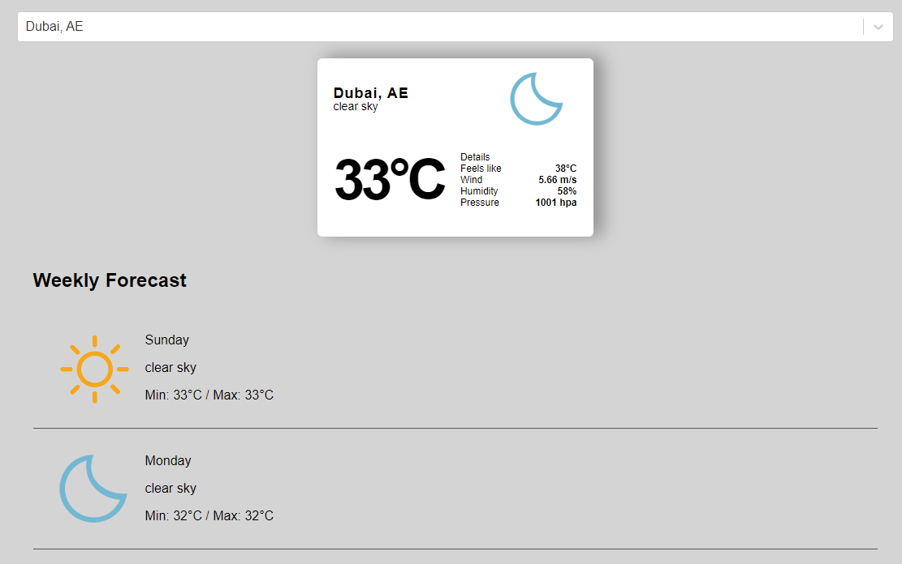

---

# Weather App

A React-based weather application that allows users to search for a city and get current weather information along with a forecast. The app uses the OpenWeatherMap API for fetching weather data.

## Table of Contents

- [Features](#features)
- [Demo](#demo)
- [Installation](#installation)
- [Usage](#usage)
- [API](#api)
- [Components](#components)

## Features

- Search for a city to get current weather information
- Display the weather forecast for the next few days
- Debounced search to minimize API calls

## Demo

 _(Include a gif or screenshot of your application)_

## Installation

1. Clone the repository:

   ```bash
   git clone https://github.com/yourusername/weather-app.git
   cd weather-app
   ```

2. Install dependencies:

   ```bash
   npm install
   ```

3. Create a `.env` file in the root directory and add your API key:
   ```
   REACT_APP_WEATHER_API_KEY=your_api_key_here
   ```

## Usage

1. Start the development server:

   ```bash
   npm start
   ```

2. Open your browser and go to `http://localhost:3000`

## API

This app uses the [OpenWeatherMap API](https://openweathermap.org/api) for fetching weather data.

- Sign up for an API key at [OpenWeatherMap](https://home.openweathermap.org/users/sign_up).
- Replace `your_api_key_here` in the `.env` file with your actual API key.

## Components

### Search Component

Located in `src/components/search/Search.jsx`, this component provides an input field for users to search for cities. It uses the `react-select-async-paginate` library to handle asynchronous loading of search results.

### CurrentWeather Component

Located in `src/components/current-weather/CurrentWeather.jsx`, this component displays the current weather information for the selected city.

### App Component

Located in `src/App.js`, this component maintains the state of the application and handles fetching weather data based on user input.

## Contributing
